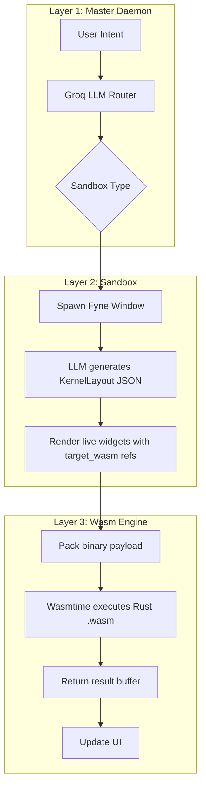

# hOSt

### An LLM-Routed Native OS Daemon with Wasm Sandboxes

   

---

### 🔗 Quick Links

- [⚡ The Core Idea](#-the-core-idea) - [⚙️ Architecture](#%EF%B8%8F-architecture-the-three-layer-stack) - [📦 Getting Started](#-getting-started)

- [✨ Sandboxes](#-sandboxes) - [🛠️ Tech Stack Decisions](#%EF%B8%8F-tech-stack-decisions) - [📂 Project Structure](#-project-structure)

---

## What Problem Does hOSt Solve?

Modern desktops force you to install full applications for operations you use once. You install Photoshop to crop a photo. You install 7-Zip to extract one archive. You install Adobe Acrobat to split a PDF. These applications sit on your machine permanently, consuming memory and disk space, waiting for the one moment you need them.

hOSt inverts this model. Instead of installing applications that contain features, you describe what you want to do in plain English. A daemon interprets your intent, spawns only the isolated capability you need, runs it inside a Wasm sandbox, and closes it when you're done.

> **"Describe intent. Spawn capability. Discard when done."**

<p align="right">(<a href="#host">back to top</a>)</p>

---

### ⚡ The Core Idea

| Model | Traditional Desktop | hOSt |
| :--- | :--- | :--- |
| **Distribution Unit** | Full application (install to get features) | Feature sandboxes (spawn only what you need) |
| **Capability Discovery** | Manual (find app, install, open) | **Natural Language** ("I want to crop an image") |
| **Execution Boundary** | OS process (no memory isolation) | **Wasm linear memory** (sandboxed by design) |
| **UI Generation** | Static (shipped with the app) | **LLM-generated at runtime** from your intent |
| **Compute Layer** | Native code (platform-specific) | **Rust compiled to Wasm** (portable, sandboxed) |

<p align="right">(<a href="#host">back to top</a>)</p>

---

## ⚙️ Architecture: The Three-Layer Stack

hOSt operates as three distinct layers that run in sequence for every operation:

**Layer 1 — The Master Daemon (LLM Intent Router)**
A single always-running Go/Fyne window with one input. You type what you want. A Groq-hosted Llama 3.3-70b model parses your intent and returns a typed sandbox identifier (`image`, `csv`, `pdf`, `crypto`, `archive`, `markdown`). The daemon spawns the corresponding sandbox window.

**Layer 2 — The Sandbox (Native Fyne Window)**
Each sandbox is an independent Go window with its own state. Inside each sandbox, a second LLM call generates a `KernelLayout` — a JSON description of the UI controls needed for your specific request. These controls are rendered as live Fyne widgets: sliders, inputs, buttons. Crucially, each control carries a `target_wasm` field pointing to the Wasm module it will invoke.

**Layer 3 — The Wasm Engine (Rust Compute)**
When you trigger an action, the Go host packs your inputs into a flat binary buffer and calls `execute()` on a Rust-compiled Wasm module via Wasmtime. The module operates entirely on its own linear memory — no WASI, no filesystem access, no imports. It returns a result buffer. The host interprets it and updates the UI.



<p align="right">(<a href="#host">back to top</a>)</p>

---

## ✨ Sandboxes

### 🖼️ Image Sandbox
Mount any `.png` file. The LLM generates context-aware sliders and buttons for the operation you described. All pixel transforms run inside isolated Rust Wasm modules. Supports undo history and save-to-disk.

| Module | Operation |
| :--- | :--- |
| `image_filter.wasm` | Grayscale & color filters |
| `invert.wasm` | Pixel inversion |
| `crop.wasm` | Region crop (x, y, w, h via sliders) |
| `resize.wasm` | Bilinear resize |

### 📊 CSV Sandbox
Mount any `.csv`. Renders a live editable table. The LLM injects tools for sorting, filtering, column deletion, and chart visualization. Filter syntax: `column == "value" && other_col > 100`.

| Module | Operation |
| :--- | :--- |
| `csv_engine.wasm` | Sort, filter (custom query engine), delete column, visualize |

Chart output opens as a native Fyne bar chart window.

### 📄 PDF Sandbox
Mount one or multiple PDFs. Issue natural language commands like *"merge pages 2 and 3 of file 1 with all of file 2"* or *"extract pages 4-7"*. The LLM parses the command into a structured `PDFCommand` JSON with op codes and page arrays.

| Op | Operation |
| :--- | :--- |
| `0` | Extract / Split pages (Rust Wasm) |
| `1` | Read / Scan text (Go native) |
| `2` | Merge PDFs (pdfcpu) |

### 🔐 Crypto Sandbox (Zero-Trust Vault)
AES-256-GCM encryption and decryption, with PBKDF2 key derivation at 100,000 iterations. All cryptographic math runs inside `crypto_engine.wasm`. On encryption, hOSt packages:
- `.enc` file (ciphertext with prepended salt + nonce)
- Standalone `Decrypt_Vault.html` (uses WebCrypto API, runs fully offline in any browser)
- `instructions.txt`

The recipient needs no software installed. The vault is self-contained.

### 🗜️ Archive Sandbox
Compress any file or folder to `.tar.gz`, or extract any `.tar.gz`. Tar packing/unpacking runs in Go; gzip compression/decompression runs inside `archive_engine.wasm`.

### 📝 Markdown Sandbox
Split-pane live transpiler. Left pane: input. Right pane: output. Supports Markdown → HTML and HTML → Markdown. Transpilation runs inside `markdown_engine.wasm` on every keystroke.

<p align="right">(<a href="#host">back to top</a>)</p>

---

## 🔩 The Wasm Memory Protocol

All Wasm modules share the same interface. No WASI. No imports. Just two exported functions:

```
alloc(size: i32) -> i32   // Returns a pointer into linear memory
execute(ptr: i32, len: i32) -> i32  // Returns output length written at ptr
```

The Go host packs all inputs into a flat binary buffer and writes it to the allocated region. The module reads it, processes in-place, and writes the result back to the same region. The host reads back `output_length` bytes.

**Example — Crypto payload layout:**
```
[OpID: 4 bytes][PassLen: 4 bytes][Password][Salt: 16 bytes][Nonce: 12 bytes][FileBytes]
```

**Example — CSV filter payload layout:**
```
[OpID: 4 bytes][QueryLen: 4 bytes][QueryString][CSVBytes]
```

This protocol is intentionally minimal. Adding a new compute module means writing a Rust `lib.rs` with `alloc` and `execute`, compiling to `wasm32-unknown-unknown`, and dropping the binary into `compiled-binaries/`.

<p align="right">(<a href="#host">back to top</a>)</p>

---

## 🛠️ Tech Stack Decisions

- **Why Go for the host:** Go's goroutine model and Fyne's immediate-mode rendering make it straightforward to spawn independent sandbox windows without threading complexity. The host is a coordinator, not a compute engine — Go is the right weight for that.

- **Why Rust for Wasm modules:** Rust compiles cleanly to `wasm32-unknown-unknown` without a runtime. The absence of a GC means the module's memory footprint is deterministic. AES-256-GCM, image transforms, and CSV processing need raw byte manipulation — Rust's ownership model makes the unsafe pointer casting in the memory protocol tractable.

- **Why Wasmtime over WASM in-browser:** Wasmtime gives a native embedding API in Go. Modules run at near-native speed, validate before execution, and are isolated from the host filesystem without any WASI configuration. The security boundary is Wasmtime's problem, not ours.

- **Why Groq / Llama 3.3-70b:** Inference latency matters here. The daemon has to feel instant. Groq's LPU hardware cuts Llama 3.3-70b inference to sub-second for the short prompts hOSt uses (intent routing, `KernelLayout` generation). OpenAI-compatible API means the client is `go-openai` with a swapped base URL.

- **Why LLM-generated UI:** The sandbox UI is not known at compile time — it depends on what you asked for. Asking for a `crop` tool should give you x/y/w/h sliders. Asking for a `brightness` tool should give you a range slider. Hardcoding all possible control layouts defeats the purpose. The LLM generates the `KernelLayout` JSON and the host renders whatever it receives.

<p align="right">(<a href="#host">back to top</a>)</p>

---

## ⚠️ Technical Trade-offs (Known & Intentional)

- **Fixed capability set:** The LLM can generate any control surface, but can only route to the Wasm modules that exist in `compiled-binaries/`. Dynamic feature generation (LLM writes Rust → compiles → executes at runtime) is the natural next step but is out of scope for this version.

- **Wasm memory sizing is manual:** Buffer sizes for decompression and PDF ops are pre-allocated with multipliers (`actualLen * 20`, etc.). This works in practice but a proper implementation would negotiate buffer size before execution.

- **PDF merge is hybrid:** Split/extract runs in Rust Wasm. Merge uses `pdfcpu` because the Wasm module's memory constraints make multi-file operations awkward. This inconsistency is noted.

- **Image format:** The image sandbox only mounts `.png`. JPEG support would require adding a decode/encode step before passing raw RGBA pixels to the Wasm modules.

- **Windows-only binary:** The compiled `host.exe` is Windows. The Go source is cross-platform; the Wasm modules are platform-agnostic. Building for Linux/macOS requires recompiling the Go daemon.

<p align="right">(<a href="#host">back to top</a>)</p>

---

## 📂 Project Structure

```text
hOSt/
├── host-daemon/
│   ├── main.go               # Master daemon, all sandbox logic, Wasm host
│   ├── ui_parser.go          # KernelComponent / Layout type definitions
│   ├── go.mod
│   └── go.sum
│
├── wasm-modules/
│   ├── crypto_engine/        # AES-256-GCM (Rust → Wasm)
│   ├── csv_engine/           # Sort, filter, chart (Rust → Wasm)
│   ├── archive_engine/       # gzip compress/decompress (Rust → Wasm)
│   ├── pdf_engine/           # Page extract/split (Rust → Wasm)
│   ├── markdown_engine/      # MD ↔ HTML transpiler (Rust → Wasm)
│   ├── image_filter/         # Grayscale filter (Rust → Wasm)
│   ├── invert/               # Pixel inversion (Rust → Wasm)
│   ├── crop/                 # Region crop (Rust → Wasm)
│   └── resize/               # Bilinear resize (Rust → Wasm)
│
└── compiled-binaries/        # Pre-built .wasm binaries (referenced at runtime)
    ├── crypto_engine.wasm
    ├── csv_engine.wasm
    ├── archive_engine.wasm
    ├── pdf_engine.wasm
    ├── markdown_engine.wasm
    ├── image_filter.wasm
    ├── invert.wasm
    ├── crop.wasm
    └── resize.wasm
```

<p align="right">(<a href="#host">back to top</a>)</p>

---

## 🚀 Getting Started

**Prerequisites**

- Go 1.21+
- A [Groq API key](https://console.groq.com/) (free tier works)
- Rust + `wasm32-unknown-unknown` target (only if rebuilding Wasm modules)

**Running from source**

```bash
git clone https://github.com/AmeeteSh-A/hOSt.git
cd hOSt/host-daemon

# Set your Groq API key
export GROQ_API_KEY=your_key_here   # Linux/macOS
set GROQ_API_KEY=your_key_here      # Windows CMD

go run main.go ui_parser.go
```

The master daemon window opens. Type what you want to do.

**Rebuilding a Wasm module (optional)**

```bash
cd hOSt/wasm-modules/crypto_engine
cargo build --release --target wasm32-unknown-unknown
cp target/wasm32-unknown-unknown/release/crypto_engine.wasm ../../compiled-binaries/
```

**Pre-built binaries** are included in `compiled-binaries/` so you don't need Rust to run hOSt.

<p align="right">(<a href="#host">back to top</a>)</p>

---

## 👨‍💻 Author

Built by **Ameetesh**
B.Tech Undergraduate (South Asian University)
Focused on Systems Engineering, Wasm runtimes, and LLM-native application design.

---

<p align="right">(<a href="#host">back to top</a>)</p>
